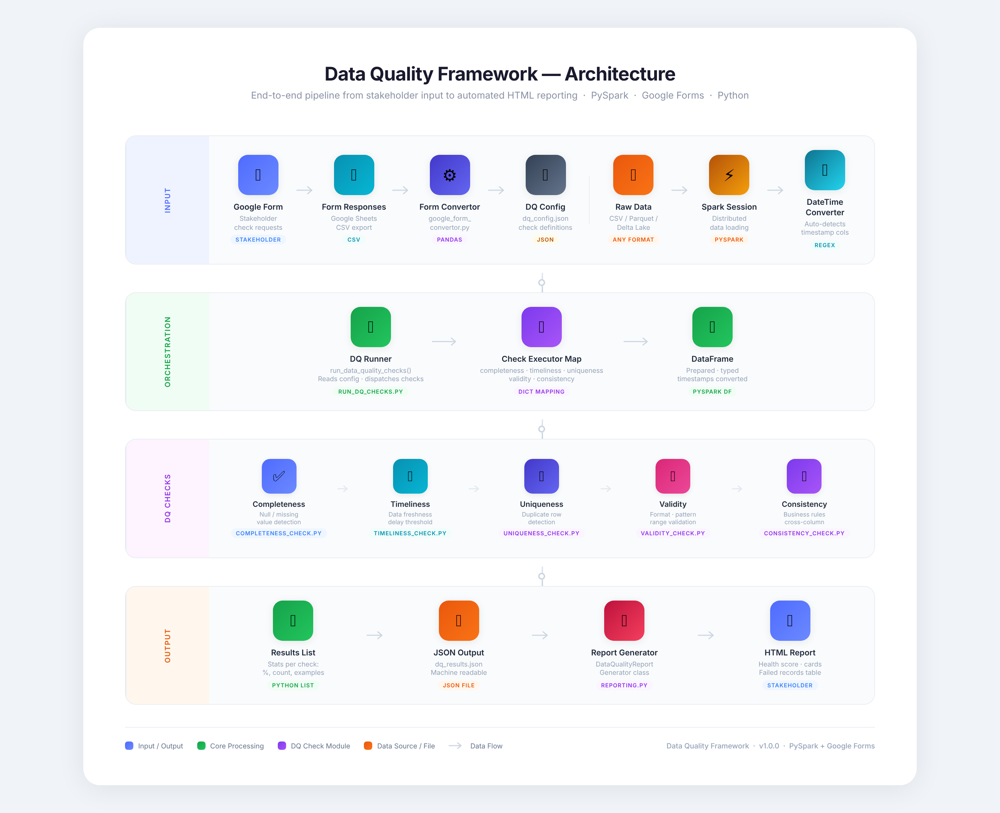
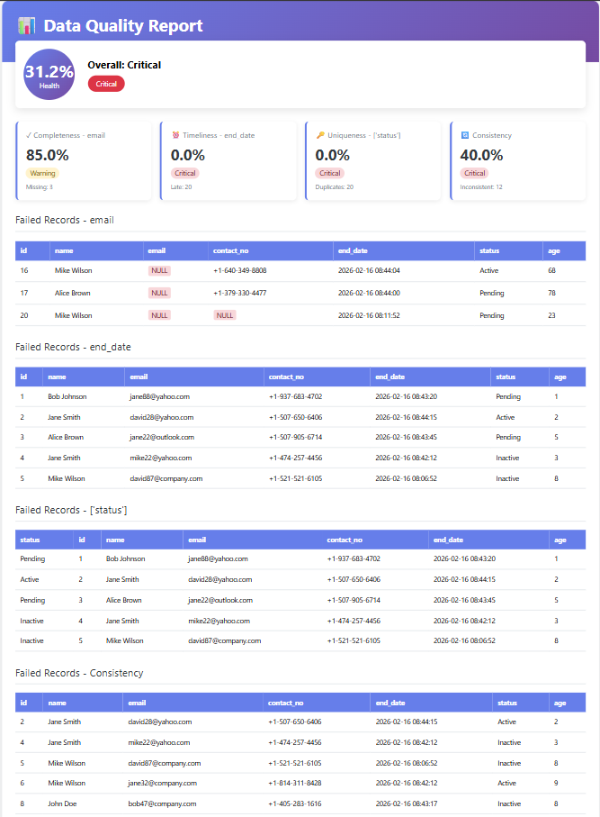

# Data Quality Framework

A comprehensive data quality validation framework built with PySpark.  
It enables teams to define quality checks easily and automatically generates clear, executive-friendly HTML reports.

---

## Purpose

The Data Quality Framework helps organizations improve trust in their data by validating it across key quality dimensions.  
It is designed to support both business stakeholders and data teams with a structured and scalable approach to data validation.

---

##  Key Features

- ✅ Five core data quality dimensions
- ✅ Google Form–based rule submission (stakeholder-friendly)
- ✅ Automated configuration generation
- ✅ Scalable PySpark-based validation engine
- ✅ Executive-ready HTML reporting
- ✅ Modular and production-ready structure

---

## 🚀 How It Works
Google Form → Configuration File → Data Validation → HTML Report

1. Stakeholders define quality requirements via a structured form.
2. Responses are converted into a machine-readable configuration.
3. The framework runs validation checks on the dataset.
4. A detailed HTML report is generated with results and insights.

Designed for:
- Business Stakeholders  
- Data Governance Teams  
- Data Engineers  
- Leadership  
---

# 🔎 Supported Data Quality Dimensions

The framework validates data across five core dimensions:

## 1️⃣ Completeness
Ensures required fields are not null or missing.

**Example:**  
- Customer email must not be empty  
- Transaction amount must be present  

---

## 2️⃣ Uniqueness
Detects duplicate records across one or multiple columns.

**Example:**  
- Customer ID must be unique  
- Combination of Order ID + Product ID must not repeat  

---

## 3️⃣ Validity
Ensures data follows expected formats, ranges, or patterns.

**Example:**  
- Email format validation  
- Date format checks  
- Numeric range validation  
- Percentage between 0–100  

---

## 4️⃣ Timeliness
Ensures records are recent and within defined freshness thresholds.

**Example:**  
- Data updated within last 24 hours  
- Transaction date not older than 30 days  

---

## 5️⃣ Consistency
Validates logical relationships between columns.

**Example:**  
- End date must be after start date  
- Discount amount cannot exceed total amount  

---

### Final report for stakeholders showing the results on different DQ checks

---

## 📦 Installation

### Requirements
- Python 3.8+
- PySpark

---
### How to use it 
run
python main_pipeline.py and 
the following output will be shown

---
### Config File Format

